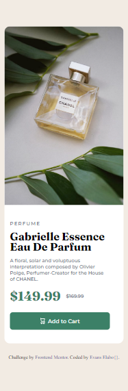

# Frontend Mentor - Product preview card component solution

This is a solution to the [Product preview card component on Frontend Mentor](https://www.frontendmentor.io/solutions/product-card-review-Z3xncFACoN). Frontend Mentor challenges help you improve your coding skills by building realistic projects. 

## Table of contents

- [Overview](#overview)
  - [The challenge](#the-challenge)
  - [Screenshot](#screenshot)
  - [Links](#links)
- [My process](#my-process)
  - [Built with](#built-with)
  - [What I learned](#what-i-learned)
  - [Continued development](#continued-development)
  - [Useful resources](#useful-resources)
- [Author](#author)
- [Acknowledgments](#acknowledgments)

## Overview

### The challenge

Users should be able to:

- View the optimal layout depending on their device's screen size

### Screenshot

### Links

- Live Site URL: [Frontend Mentor | Product Previw Card](https://product-card-preview-html-css.netlify.app)

## My process

### Built with

- Semantic HTML5 markup
- CSS custom properties
- Flexbox

### What I learned

1. Media Queries with CSS
2. Create Design Resonsiveness

### Continued development
I am learning to set different images for distinct breakpoints.

### Useful resources

- [W3schools](https://www.w3schools.com) - This website helped me understand the basic use of padding and Media Queries

## Author

- Frontend Mentor - [@ellaboevans](https://www.frontendmentor.io/profile/ellaboevans)
- Twitter - [@theEvansElabo_](https://www.twitter.com/theevanselabo_)
- LinkedIn - [@evans-elabo](https://www.linkedin.com/in/evans-elabo)

## Acknowledgments

Thanks to all web developers on Youtube who share such wonderful resources and also to frontend mentor for providing such challenging exercise to improve ones styling skills. Cheers!

